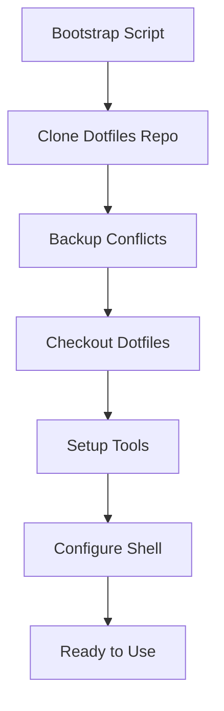

# Dotfiles Bootstrap & Setup Wiki

Welcome to the dotfiles bootstrap and setup system wiki! This system helps you quickly set up and manage your personal dotfiles across multiple platforms.

## 📋 Quick Navigation

-   **[Installation Guide](Installation.md)** - Complete setup instructions
-   **[Configuration Options](Configuration.md)** - Customization and configuration
-   **[Platform Notes](Platform-Notes.md)** - Platform-specific information
-   **[Troubleshooting](Troubleshooting.md)** - Common issues and solutions
-   **[FAQ](FAQ.md)** - Frequently asked questions
-   **[Migration Guide](Migration-Guide.md)** - Moving from other dotfiles systems

## 🎯 What This System Does

This bootstrap system:

1.  **Clones your dotfiles** from a separate repository as a bare Git repo
2.  **Backs up conflicting files** automatically
3.  **Sets up the `dotfiles` command** for easy management
4.  **Installs essential tools** based on your platform
5.  **Configures your shell** with proper aliases and functions

## 🏗️ System Architecture

## 🚀 Quick Start

1.  Clone this bootstrap repository
2.  Run `./bootstrap` to set up your dotfiles
3.  Run `./setup` to install tools and configure your environment
4.  Use `dotfiles <command>` to manage your configurations

## 📦 Repository Structure

-   **Bootstrap Scripts** - Platform-specific installation scripts
-   **Setup Scripts** - Tool installation and environment configuration
-   **Templates** - Configuration file templates
-   **Documentation** - Detailed guides and troubleshooting
-   **Wiki** - This knowledge base

## 🔗 Related Repositories

-   **[Your Dotfiles Repo](https://github.com/kjanat/dotfiles)** - Your actual configuration files
-   **[Oh My Posh Themes](https://ohmyposh.dev/docs/themes)** - Terminal prompt themes
-   **[Awesome Dotfiles](https://github.com/webpro/awesome-dotfiles)** - Community dotfiles inspiration

---

*Last updated: May 2025*
